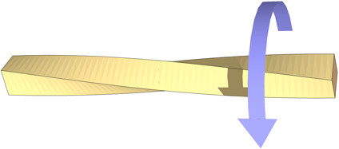
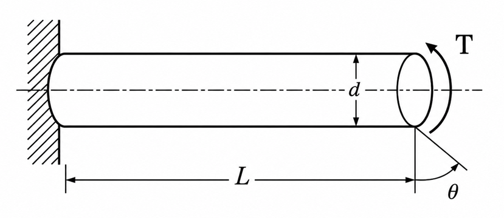

### Introduction

Many engineering components such as transmission shafts, axles, screwdrivers, drill bits, propeller shafts, and steering columns are subjected to twisting forces during operation. These twisting forces produce **torque**, which causes the member to rotate about its longitudinal axis and develop internal shear stresses.

A torsion test is performed to study the behaviour of a material when subjected to torque. The test helps determine the relationship between the applied torque and the resulting angle of twist and is used to evaluate the **Modulus of Rigidity (Shear Modulus)** of the material.

The experiment is carried out using a **Torsion Testing Machine**, which applies a gradually increasing torque while measuring the corresponding angle of twist.

### Physical Concept

Consider a prismatic shaft fixed at one end and subjected to a torque at the other end.

<b>Figure 1. Twisting of a shaft due to an applied torque.</b>

When torque is applied,

- Every cross-section of the shaft rotates through a small angle.
- The free end twists relative to the fixed end.
- Internal resisting shear stresses develop throughout the shaft.
- The maximum shear stress occurs at the outer surface, while the stress at the centre is zero.

Within the elastic limit, the angle of twist is directly proportional to the applied torque.

<b>Figure 2. Circular shaft used in the derivation of the torsion equation.</b>

### Everyday Intuition

Twisting action is commonly experienced in everyday life.

Examples include:

- Tightening or loosening a bolt using a spanner.
- Turning a screwdriver.
- Rotating a door handle.
- Twisting a towel to squeeze out water.
- Transmission shafts carrying power from an engine to vehicle wheels.

In each case, the applied torque causes the object to twist.

### Experimental Relevance

The torsion test helps determine the torsional properties of engineering materials and verifies the theoretical relationship between torque and angle of twist.

The experiment enables determination of:

- Modulus of Rigidity (Shear Modulus)
- Angle of twist
- Shear stress
- Shear strain
- Torque–twist relationship

These properties are essential in the design of rotating machine elements subjected to torsional loading.

### Apparatus and Working Principle

The experiment is performed using a **Torsion Testing Machine**.

The major components include:

- Fixed chuck
- Rotating chuck
- Torque measuring mechanism
- Angle of twist measuring dial
- Loading hand wheel or motor drive
- Test specimen

The circular specimen is firmly held between the two chucks. One end remains fixed while torque is gradually applied at the other end.

As the applied torque increases, the specimen twists through a measurable angle. The applied torque and corresponding angle of twist are recorded until the required loading condition or failure is reached.

### Mathematical Formulation

#### Torsion Equation

For a solid circular shaft within the elastic limit,

$$
\frac{T}{J}=\frac{\tau}{R}=\frac{G\theta}{L}
$$

where

- $T$ = Applied torque (N·mm)
- $J$ = Polar moment of inertia (mm$^4$)
- $\tau$ = Maximum shear stress (N/mm$^2$)
- $R$ = Radius of the shaft (mm)
- $G$ = Modulus of Rigidity (N/mm$^2$)
- $\theta$ = Angle of twist (radians)
- $L$ = Gauge length of the specimen (mm)

#### Polar Moment of Inertia

For a solid circular shaft,

$$
J=\frac{\pi d^4}{32}
$$

where

- $d$ = Diameter of the shaft

#### Maximum Shear Stress

The maximum shear stress developed in the shaft is

$$
\tau=\frac{TR}{J}
$$

For a solid circular shaft,

$$
\tau=\frac{16T}{\pi d^3}
$$

#### Angle of Twist

The angle of twist is given by

$$
\theta=\frac{TL}{GJ}
$$

This equation shows that

- the angle of twist increases with increasing torque,
- increases with shaft length,
- decreases with increasing shaft diameter,
- decreases as the material becomes more rigid.

#### Modulus of Rigidity

Rearranging the torsion equation,

$$
G=\frac{TL}{J\theta}
$$

The modulus of rigidity represents the resistance of a material to shear deformation.

Materials having higher values of $G$ undergo smaller angular deformation for the same applied torque.

### Shear Stress Distribution

One important feature of torsion is the variation of shear stress across the shaft.

- Shear stress is zero at the centre.
- Shear stress increases linearly with radius.
- Maximum shear stress occurs at the outer surface.

This is one reason why hollow shafts are often preferred in engineering applications—they provide high torsional strength with reduced material usage and weight.

### Assumptions of the Theory

The torsion equation is valid under the following assumptions:

- The material is homogeneous and isotropic.
- The material behaves elastically (Hooke's Law is applicable).
- The shaft has a uniform circular cross-section.
- Plane cross-sections remain plane after twisting.
- Twist is uniform along the length of the specimen.

### Engineering Significance

Torsion testing plays an important role in mechanical, civil, and structural engineering.

The experimental results help engineers:

- Design transmission shafts and axles.
- Select suitable materials for rotating machinery.
- Predict torsional deformation.
- Ensure safe operation under twisting loads.
- Verify material properties used in engineering design.

Understanding torsional behaviour is essential for the safe and efficient design of power transmission systems, machine components, and structural members subjected to twisting moments.
